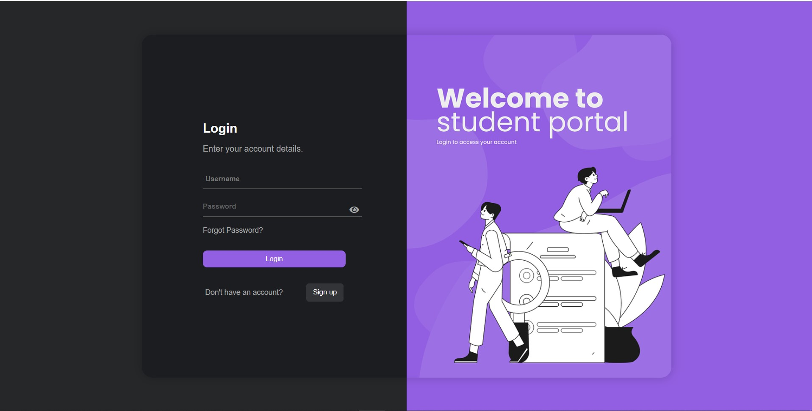

# Student Management System

Welcome to the Student Management System repository! This project is a web application developed using Django, designed to manage student registrations, attendance tracking, and administrative tasks. Below is an overview of the project and its functionalities.

## Overview

The Student Management System provides the following features:

1. **Student Registration**: Allows students to register by providing necessary details.
2. **Admin Approval**: Admins can approve or reject student registrations.
3. **Attendance Tracking**: Tracks student attendance and calculates attendance percentage.
4. **Mark Attendance**: Admins can mark student attendance for specific dates.
5. **Manage Attendance**: Admins can view and edit attendance records.
6. **Manage Students**: Admins can view, edit, and delete student details.

## Screenshots

### Student Login and Registration Page



### Admin Dashboard - Student Approval


### Student Attendance Detail


## Set Up Email Backend

Open the `settings.py` file located in the `student_management_system` directory and configure the email backend settings as follows:

    ```python
    EMAIL_BACKEND = 'django.core.mail.backends.smtp.EmailBackend'
    EMAIL_HOST = 'smtp.gmail.com'
    EMAIL_PORT = 587
    EMAIL_USE_TLS = True
    EMAIL_USE_SSL = False
    EMAIL_HOST_USER = 'your_email@gmail.com'
    EMAIL_HOST_PASSWORD = 'your_email_password'
    ```

    Replace `'your_email@gmail.com'` and `'your_email_password'` with your Gmail email address and password, respectively. Make sure to enable less secure apps access for your Gmail account if you're using Gmail as the email backend.

## How to Use

1. **Clone the Repository**: Clone this repository to your local machine using the following command:
    ```bash
    git clone https://github.com/yourusername/student-management-system.git
    cd student-management-system
    ```

2. **Install Dependencies**: Install Django and other dependencies by running:
    ```bash
    pip install -r requirements.txt
    ```

3. **Run the Application**: Run the Django development server using the following command:
    ```bash
    python manage.py runserver
    ```

4. **Access the Application**: Open your web browser and navigate to [http://localhost:8000](http://localhost:8000) to access the application.

## Contributing

Contributions to this project are welcome! If you have any improvements, bug fixes, or new features to add, please submit a pull request. Ensure your contributions follow the existing code style and documentation.

## License

This project is licensed under the MIT License. See the [LICENSE](LICENSE) file for more details.
